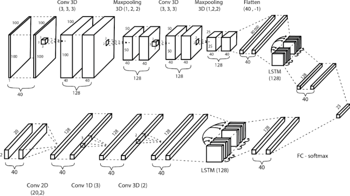
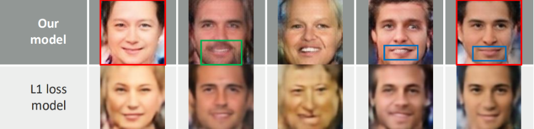
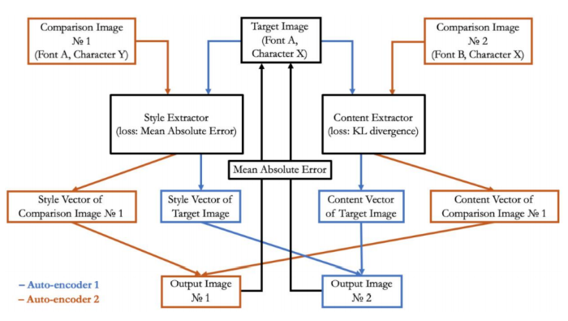
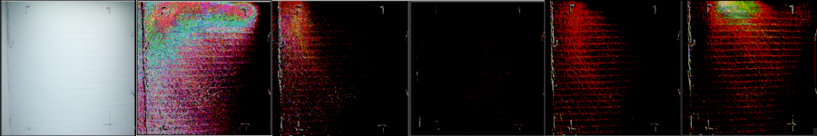

# 2019-2020 Research by SPCC-AIPG
20-member AI Project Group from St. Paul's Co-educational College HK. Our mission is to create a culture for AI and technological research in our school. To view our papers, investigations, and presentations, feel free to check out the "DOCS" folder.  

## Research list
- [Cantonese Lip Reading](#Cantonese-Lip-Reading)
- [Novel Eye-to-face Synthesis with Standard Deviation Loss](#Novel Eye-to-face Synthesis with Standard Deviation Loss)
- [Real-time Singing Voice Vocal Register Classification](#Real-time Singing Voice Vocal Register Classification)
- [Novel Font Style Transfer Across Multiple Languages with Double KL-Divergence Loss](#Novel Font Style Transfer Across Multiple Languages with Double KL-Divergence Loss)
- [Computational Content Classification of Traditional Chinese poems](#Computational Content Classification of Traditional Chinese poems)
- [Computational Content Classification of Traditional Chinese poems](#Computational Content Classification of Traditional Chinese poems)

## Cantonese Lip Reading
  
**Picture:** *Proposed architecture of our state-of-the-art cantonese lip reading model.*  

**Authors:**  
Luo Steven Tin Sui, Woody Lam, Julian Chu, Samuel Yau  
**Awards:**  
Special Prize -- First Sensetime International Artificial Intelligence Fair; Champion -- Sensetime x CUHK AI Competition for Secondary Schools; Intel ISEF Regional Finalist  

> **Abstract:** *In this paper, we would present to you our method of data collection, data preprocessing, and evaluate the different models trained upon our dataset. Our work is divided into 3 main stages: 1) comparing CNN and LSTM models with both raw pixel data and dotpos data, 2) combining CNN and LSTM to improve model performance, and 3) building models using both dotpos data and raw pixel data at the same time to build a more robust model. This works serves as a direction for lip reading as well as video processing in general.*  

**Research status:** Complete  
**Github status:** Paper uploaded; Code Uploading...
## Novel Eye-to-face Synthesis with Standard Deviation Loss
  
**Picture:** *Comparing image quality of face generated by model with std-loss and without std-loss (non-adversarial)*  
  
**Authors:**  
Rex Tse, Luo Steven Tin Sui, Peter Ng, Ronnie Jok  
**Awards:**  
1st Prize -- Second Sensetime International Artificial Intelligence Fair  

> **Abstract:** *Smart surveillance technology is becoming increasingly prevalent nowadays with the rise of artificial intelligence aiming for more precise and effective security systems, where face recognition is an important part of it. While the technology of identifying faces has been rapidly growing, in some cases, surveillance cameras can only catch some parts of a face, where computer generation of the whole face comes handy. To address this issue, this paper proposes a new Standard Deviation Loss to increase variety of output images, eliminating mode collapse, along with an approach for eye-to-face synthesis by using a generative autoencoder model with feature loss (using the VGG19 model).*  

**Research status:** On-goiing and preparing for publication    
**Github status:** Paper uploaded; Code Uploading...
## Real-time Singing Voice Vocal Register Classification
  
**Picture:** *Comparing performance among 1D-CNN convolving on time-axis, 1D-CNN convolving on frequency-axis, and 2D-CNN convolving on entire STFT*  

**Authors:**  
Luo Steven Tin Sui, Justin Lam, Angel Au  
**Awards:**  
1nd Prize -- Second Sensetime International Artificial Intelligence Fair  

> **Abstract:** *In recent decades, many researchers have looked into various areas of music using artificial intelligence, including creative music generation, synthesis of singing voice and musical style transfer, etc. Currently, most voice-related classification papers have placed their focus on speech identification rather than singing voice, placing an emphasis on Support Vector Machines (SVMs) and the use of Mel-frequency cepstral coefficients (MFCCs). To explore the area of singing voice, we have created a model to identify and classify various timbres of different vocal registers through quantitative analysis, which could aid amateur singers on their journey of learning about singing and improving their singing techniques. Four chosen vocal registers, chest voice, mixed voice, head voice and whistle register were classified by our model as they are the most common vocal registers. Our dataset consists of extracted vocals from professionally produced songs and opera singing datasets that are available online. Convolutional Neural Networks were used in several experimental stages and results yielded proved its ability to classify for singing voice vocal registers in real time Our model has showed its capacity to be applied in real-time conditions, with an accuracy of (bruh) in our training and validation dataset. Looking into the future, we look forward to training our model with an extensive dataset and implementing the model in an appropriate medium such as an application.*  

**Research status:** Complete  
**Github status:** Paper uploaded; Code Uploading...
## Novel Font Style Transfer Across Multiple Languages with Double KL-Divergence Loss
  
**Picture:** *Training pipeline to utilize double KL-divergence loss*  

> **Abstract:** *Pending...*

**Authors:**  
Chan Lap Yan Lennon, Luo Steven Tin Sui, Kong Chi Yui, Cheng Shing Chi Justin  
**Research status:**  
On-going and preparing for publication  
**Github status:** Paper uploaded; Code Uploading...
## Computational Content Classification of Traditional Chinese poems

> **Abstract:** *Analysis of Chinese poetry according to content is a challenging task in the field of NLP. On the other hand, it is a very difficult and timeconsuming task for poems to be classified manually and objectively. While for other languages, like English, automatic poetry classification has been investigated using several NLP techniques, it is not that common for Chinese poetry. The goal of this paper is to develop an ideal model for Chinese poem genre classification. To achieve our objectives, we have prepared a corpus consisting of a variety of Chinese poems representing a variety of linguistic features. This project utilizes 2 computational methods namely LSTM and Transformer models in Deep Learning, to classify poems based on the top seven typical themes that inheres in Chinese poems. The results of these models are compared, so as to find the best model for accurate classification of poems. Evaluation on the effectiveness of these different systems is done through comparing the accuracies and loss, distinguishing the impacts brought by the differences between the models and then further optimize the model based on the information, finally establishing an architecture with the most satisfactory results with a training accuracy of 97% and a validation accuracy of 82%.*  

**Authors:**  
Ally Lo, Grace Tong, Luo Steven Tin Sui, Olga Chan  
**Research status:** Complete  
**Github status:** Paper uploaded; Code Uploading...
## Non-line-of-sight (NLOS) object classification 
  
**Picture:** *From left to right: Shadow image, Gaussian amplified with a.p. factor of 100 {blue correction tape, blue matt ornament, blue bug, blue pen sharpener, blue matt ornament}*  

**Authors:**  
Lee Shun Yat, Tang Justin Kit Hang, Luo Steven Tin Sui  
**Research status:** On-going (preliminary research)  
**Github status:** Preliminary investigation results uploaded
